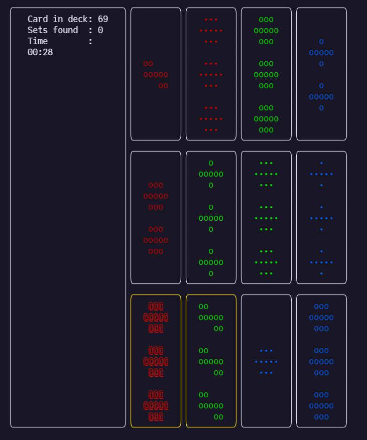

# SetGame.jl
A terminal-based implementation of the card game [_SET_](https://en.wikipedia.org/wiki/Set_(card_game))

## Quick Start
```[sh]
$ julia --project=. -e "using SetGame; playset!()"
```

## Preview
<p align="center">

</p>
